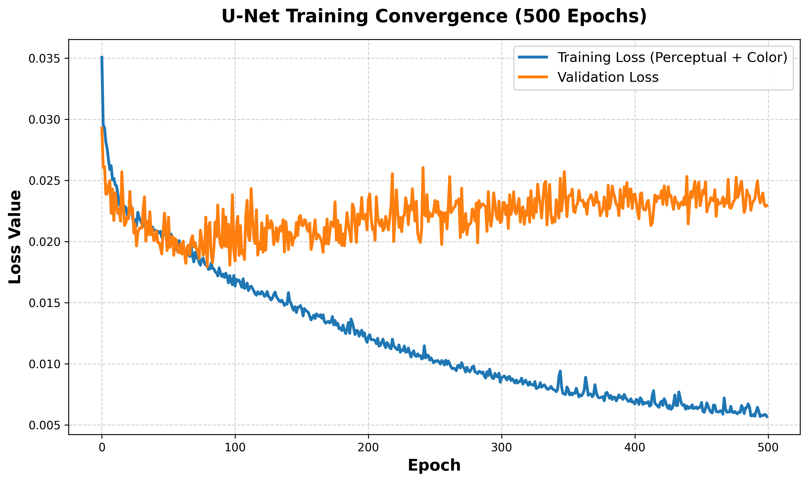

# Deep Perceptual Low-Light Image Enhancer

A deep learning project designed to enhance dark, low-light, and noisy images using a custom U-Net architecture. Unlike standard enhancement models that rely solely on pixel-level metrics like Mean Squared Error (MSE), this model introduces a **Color Alignment Loss** and a **VGG19-based Perceptual Loss** to ensure the enhanced images not only match the ground truth mathematically, but also *look* perceptually sharp and vibrant to the human eye.

## 🚀 Key Features
- **Custom U-Net Architecture:** Built from scratch with an encoder-decoder structure and skip connections to preserve high-frequency spatial details.
- **VGG19 Perceptual Loss:** Extracts feature maps from a pre-trained VGG19 network (`block2_conv2` and `block3_conv4`) to heavily penalize blurry or structurally inaccurate enhancements.
- **Color Alignment Loss:** A statistical loss function that forces the model to match the mean and standard deviation of the color distributions, preventing the washed-out look common in low-light enhancement.
- **High-Resolution Inference:** Features a custom `predict.py` script that utilizes overlapping patch-based processing and 2D Bartlett window blending. This allows a model trained on 256x256 patches to seamlessly enhance 4K images without grid-line artifacts or GPU memory overflows.
- **Automated Pipeline:** Contains a fully parameterized Python pipeline (`run_full_experiment.py`) for training, validating, and executing hyperparameter tuning.

## 📁 Repository Structure
- `run_full_experiment.py`: The core execution script. Handles dataset verification, multi-stage training, and evaluation.
- `predict.py`: Inference script for enhancing custom high-resolution images using overlapping patches and Bartlett window blending.
- `create_notebooks.py`: Generates Jupyter notebooks for step-by-step experimentation and visualization.
- `notebooks/`: Contains the generated exploratory notebooks.
- `requirements.txt`: Python environment dependencies.

## 🛠️ Usage

### 1. Prepare the Dataset
The model expects paired low-light and bright images (e.g., the LOL Dataset). Place them in the following structure:
```text
data/
  train/
    low/
    high/
  eval/
    low/
    high/
```

### 2. Training the Model
The pipeline is designed to be trained in stages. You can run these commands directly on a local GPU or in Google Colab.

```bash
# 1. Train the baseline model (MSE only)
python run_full_experiment.py --baseline

# 2. Train the perceptual model (introduces VGG19 loss)
python run_full_experiment.py --perceptual

# 3. Execute hyperparameter tuning for loss weights
python run_full_experiment.py --experiments

# 4. Final long training (500+ epochs)
python run_full_experiment.py --long

# 5. Evaluate all trained checkpoints on the eval set
python run_full_experiment.py --evaluate
```

All trained `.keras` checkpoints, training logs (CSV), and evaluation image outputs are automatically saved to the `models/training_runs/` directory.

### 3. High-Resolution Inference (Custom Images)
To enhance your own dark images (including 4K/high-res photos), use the dedicated prediction script. This script automatically slices the image, applies the enhancement, and blends it back together seamlessly.

```bash
python predict.py --image path/to/your/dark_image.jpg --model models/best_model_fresh_500.keras
```

## 📈 Evaluation Metrics
The pipeline automatically evaluates all models using standard image reconstruction metrics:
- **PSNR** (Peak Signal-to-Noise Ratio)
- **SSIM** (Structural Similarity Index)
- **MSE** (Mean Squared Error)

## 📊 Training Convergence
Below is the training and validation loss curve over 500 epochs for the final perceptual model. The smooth convergence demonstrates the effectiveness of the hybrid loss function.


